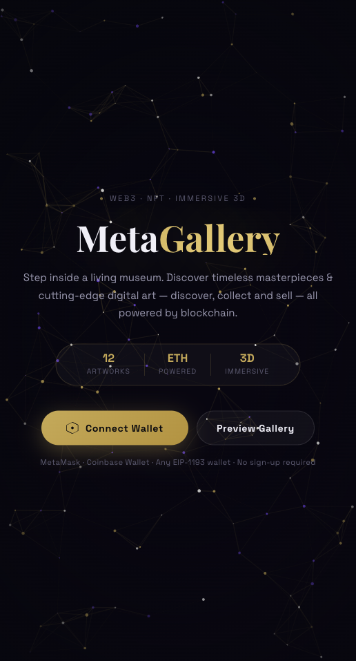
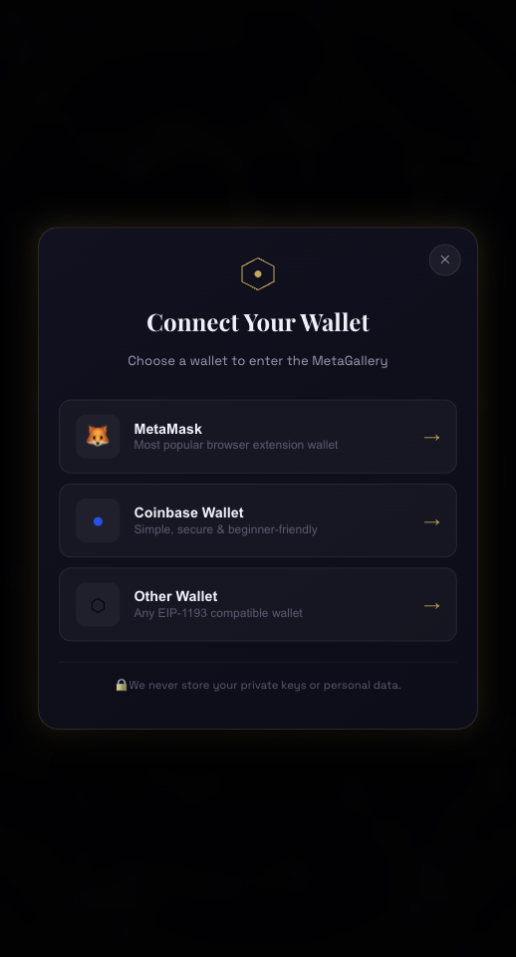
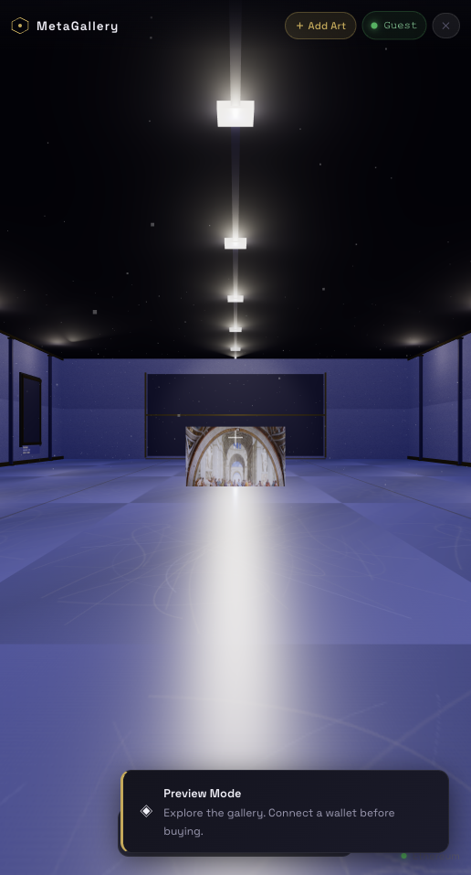
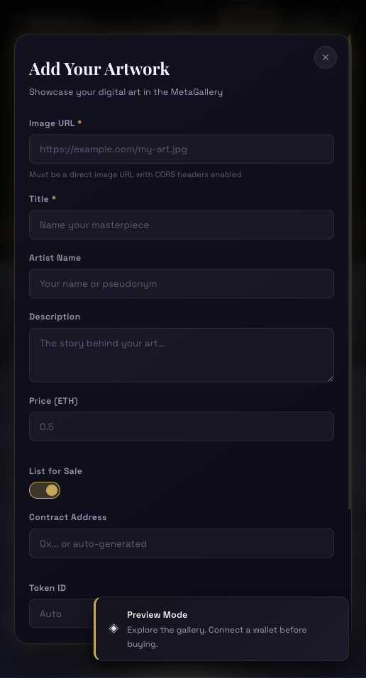
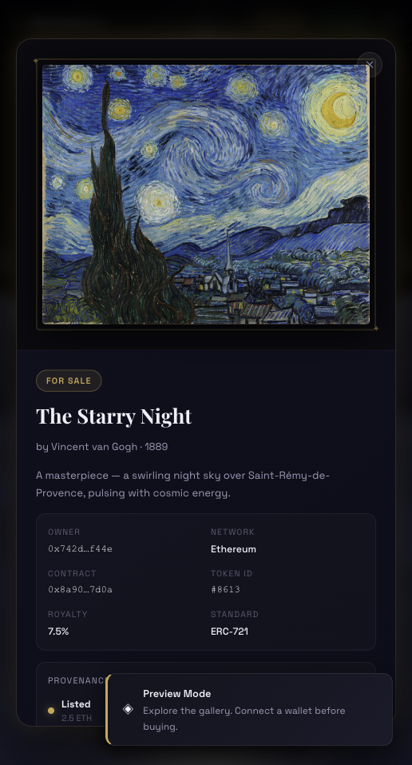
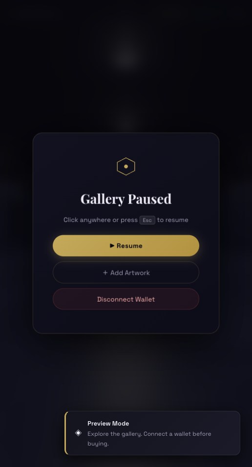

# MetaGallery

An immersive Three.js NFT art gallery with wallet connection, guest preview, camera-relative movement, marketplace metadata, artwork listing, provenance history, and local activity tracking.

## Screenshots

### Landing



### Wallet Connect



### Gallery Preview



### Add Artwork



### Artwork Details



### Pause Menu



## Features

- 3D museum scene with framed artwork, lighting, particles, placards, and hover interaction.
- Camera-relative `WASD` and arrow-key movement, so forward/left/right/down follow the current screen view.
- Wallet connection through any EIP-1193 provider, with guest preview mode for users without a wallet.
- NFT-style metadata: contract address, token ID, token standard, creator royalty, chain, verified state, and provenance.
- Add-art workflow with image preview, sale status, price, contract, token ID, royalty, and standard fields.
- Desktop marketplace HUD with item count, listed count, floor price, estimated value, and recent activity.
- Click visible artwork from anywhere in the gallery to open its NFT detail panel.

## Run Locally

```bash
python3 -m http.server 5173
```

## Vercel URL
Open [https://metagallery-vercel-deploy.vercel.app/](https://metagallery-vercel-deploy.vercel.app/).
